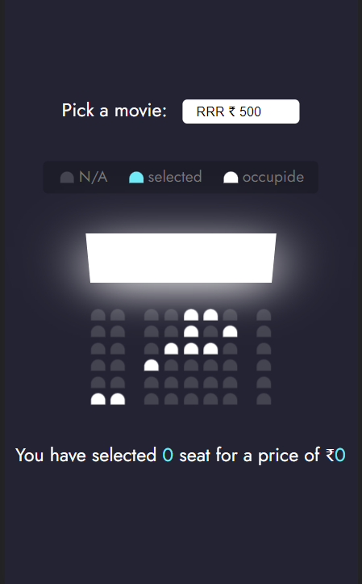

# Movie Seat Booking

## Description

Movie Seat Booking is a user-friendly app that lets you book seats for your favorite movies effortlessly. Its intuitive interface allows you to select a movie, choose seats, and view the total price – all while ensuring your data is saved in Local Storage for a seamless experience even after refreshing the page.

## Project Highlights

- **Interactive UI:** 🎉 The app features a visually appealing user interface that includes options for movie selection, seat picking, and a helpful legend to guide you.

- **Choose Your Movie:** 🍿 Browse through the available movies and pick the one you're excited to watch, complete with its corresponding price.

- **Seat Selection Made Easy:** ✨ Simply click on the seats you want, and they will be highlighted to show they are selected. Easily deselect any seat if you change your mind.

- **Seat Availability Check:** 🔍 Occupied seats are off-limits, ensuring you only choose from available seats.

- **Real-time Updates:** ⏱️ Watch the number of selected seats and the total price update dynamically as you make your choices.

- **Never Lose Your Selections:** 💾 The app intelligently stores your selected seats, movie choice, and total price in Local Storage, so you don't lose your progress, even if you refresh the page.

## Installation

To experience the Movie Seat Booking app, follow these steps:

1. Download or clone the repository to your local machine.

2. Open the `index.html` file in your preferred web browser.

## Usage

Ready to book your movie seats? Here's how:

1. Launch the app by opening the `index.html` file in your web browser.

2. Browse the list of available movies and choose the one that excites you the most, along with its corresponding ticket price.

3. Click on the seats you wish to book, and they will be highlighted for your convenience.

4. Changed your mind about a seat? No worries! Simply deselect it, and it will be available for others.

5. Watch the number of selected seats and the total price update in real-time as you make your choices.

6. Your seat selection, chosen movie, and total price will be automatically saved in Local Storage, so you can continue from where you left off even if you refresh the page.

